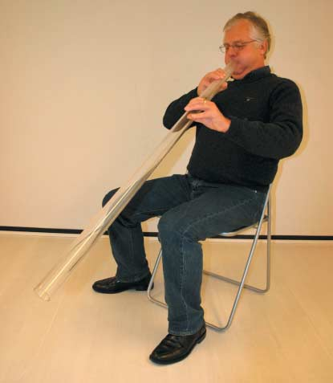

```{r setup, include = FALSE}
library(knitr)
opts_chunk$set(echo = FALSE, include = FALSE, fig.path = "Figures/", dev = "jpeg")

##  Number of decimals to round.
rnd <- 2
```

```{r ReadInOfData}
didg <- read.table("Data/Didgeridoo.csv", sep = ",", stringsAsFactor = TRUE, header = TRUE)
```

```{r ChangeDataToLongFormat}
##  Reshape to long format.
didg.long <- reshape(data = didg[, c("id", "group", "epworth1", "epworth2")], varying = c("epworth1", "epworth2"), sep = "", idvar = "id", direction = "long")

##  Change 'time' to factor and give proper "labels",
didg.long$time <- factor(didg.long$time, levels = c(1, 2), labels = c("Baseline", "Follow-Up"))
```


# Introduction

Snoring and obstructive sleep apnoea syndrome are two highly prevalent sleep disorders caused by collapse of the upper airways.[^Caples2005] The most effective intervention for these disorders is continuous positive airway pressure therapy, which reduces daytime sleepiness and the risk of cardiovascular morbidity and mortality in the most severely affected patients (apnoea-hypopnoea index >30). For moderately affected patients (apnoea-hypopnoea index 15--30) who complain about snoring and daytime sleepiness, however, continuous positive airway pressure therapy may not be suitable and other effective interventions are needed.[^LewisAl2004]

AS, a didgeridoo instructor, reported that he and some of his students experienced reduced daytime sleepiness and snoring after practising with this instrument for several months. In one person, the apnoea-hypopnoea index decreased from 17 to 2. This might be due to training of the muscles of the upper airways, which control airway dilation and wall stiffening. We tested the hypothesis that training of the upper airways by didgeridoo playing reduces daytime sleepiness in moderately affected patients.


[^Caples2005]: Caples SM, Gami AS, Somers VK. _Obstructive sleep apnea_. **Ann Intern Med** 2005;142:187--97.
[^LewisAl2004]: Lewis KE, Seale L, Bartle IE, Watkins AJ, Ebden P. _Early predictors of CPAP use for the treatment of obstructive sleep apnea_. **Sleep** 2004;27:134--8.


# Methods

## Participants

We included German speaking participants aged >18 years with self reported snoring and an apnoea-hypopnoea index of 15--30 (determined by a specialist in sleep medicine within the past year). Exclusion criteria were current continuous positive airway pressure therapy, use of drugs that act on the central nervous system (such as benzodiazepines), current or planned intervention for weight reduction, consumption of $\geq$ 14 alcoholic drinks a week or &ge; 2 a day, and obesity (body mass index &ge;30 kg/m^2^).

We randomised enrolled patients into an intervention group with didgeridoo training or a control group. We used STATA software (STATA 8.2, College Station, Tx) to generate the randomisation list (ralloc command) with stratification for disease severity (apnoea-hypopnoea index 15--21 or 22--30 and Epworth score <12 or &ge;12). The randomisation list was concealed from the recruiting physicians and the didgeridoo instructor in an administrative office otherwise not involved in the study. We used a central telephone service, which the didgeridoo instructor used to obtain group allocation.


## Treatment Groups

### Intervention Group

Participants in the _intervention group_ started their didgeridoo training after the instructor received group allocation. The instructor (AS) gave the first individual lesson immediately after randomisation. In the first lesson, participants learnt the lip technique to produce and hold the keynote for 20--30 seconds. In the second lesson (week 2) the instructor explained the concept and technique of circular breathing.




### Control Group

Participants in the _control group_ remained on a waiting list to start their didgeridoo training after four months. They were not allowed to start didgeridoo playing during these four months.


## Outcome Measures

Our primary outcome was daytime sleepiness as measured by the Epworth scale, which has been validated in German speaking patients. Scores range from 0 (no daytime sleepiness) to 24, and scores >11 represent excessive daytime sleepiness.

Secondary outcomes included three additional sleep related outcomes measures: the apnoea-hypopnoea index, the Pittsburgh quality of sleep index, and a partner’s rating for sleep disturbance.


---

# Analysis

We analysed all data on an intention to treat basis. For the primary analysis we compared change scores (differences between baseline and follow-up) between groups using two sample t tests. We also performed an analysis of covariance with the primary and secondary continuous end points at four months after randomisation as the dependent variables and their baseline values, markers of severity of disease (apnoea-hypopnoea index and Epworth score), weight change, and group allocation as independent variables.

All analyses were performed using `r sessionInfo()$R.version$version.string`.


---

# Results


The first ten participants are shown in Tab. 0.

```{r First10ParticipantsKable, include = TRUE}
kable(didg[1:10, ], align = rep("c", ncol(didg)), caption = "Tab. 0: The first ten participants in the study. **Epworth1** and **Epworth2** are the baseline and follow-up measurements of the Epworth Scale. **ah1** is the baseline apnoe-hypopnoe index. **dweight** indicates the difference in weight [kg] between follow-up and baseline.")
```


Table 1 shows the characteristics of the participants at the beginning of the study.

```{r Table1, eval = FALSE, include = TRUE, message = FALSE}
library(table1)
table1(~ sex + age + bmi + epworth1 + ah1 | group, data = didg, footnote = "Tab. 1: Characteristics of participants according to allocation to intervention (didgeridoo) or control.")
```


Figure 2 shows the individual responses in daytime sleepiness in the two groups.

```{r EpworthByGroup, include = TRUE, fig.height = 6, fig.width = 8, fig.cap = "Fig. 2: Individual responses in daytime sleepiness for the two groups, showing direction of change. The two measurements of a participant are connected with a line."}
library(ggplot2)
ggplot(data = didg.long, aes(x = time, y = epworth, group = id)) + geom_point() + facet_wrap(~ group) + geom_line()
```


Table 2 summarizes the baseline and follow-up measurements, as well as the effect of didgeridoo playing on daytime sleepiness.


```{r Descriptives}
didg$depworth <- didg$epworth2 - didg$epworth1
dd <- data.frame(Didg.mean = apply(X = didg[didg$group == "Didgeridoo", c("epworth1", "epworth2", "depworth")], MARGIN = 2, FUN = mean),
                 Didg.sd = apply(X = didg[didg$group == "Didgeridoo", c("epworth1", "epworth2", "depworth")], MARGIN = 2, FUN = sd),
                 Ctrl.mean = apply(X = didg[didg$group == "Control", c("epworth1", "epworth2", "depworth")], MARGIN = 2, FUN = mean),
                 Ctrl.sd = apply(X = didg[didg$group == "Control", c("epworth1", "epworth2", "depworth")], MARGIN = 2, FUN = sd))
rownames(dd) <- c("Baseline", "Follow-up", "Difference")
```

```{r DescriptivesTable, include = TRUE}
kable(dd, align = rep("c", ncol(dd)), digits = 2, caption = "Tab. 2: Baseline values and measurements of daytime sleepiness (Epwortj index) after four months follow-up, split by intervention group.")
```


The effect of didgeridoo playing on the Epworth index was assessed without adjustment (t test) and with adjustment for the severity of the disease (analysis ov covariance, ANCOVA). See Table 3 for the results.

```{r EstimatedEffects}
##  Raw (or undajusted) effect.
##  ---------------------------
fm <- lm(depworth ~ 1 + group, data = didg)
#plot(fm)

##  Equivalent to
#t.test(depworth ~ group, data = didg, var.equal = TRUE)

##  Store the confidence interval.
eff.ci <- confint(fm)["groupDidgeridoo",]


##  Adjusted for severity of disease ('ah1' and 'epworth1') and weight change during
##  the study period ('dweight').
fm.adj <- lm(epworth2 ~ 1 + group + ah1 + epworth1 + dweight, data = didg)
#plot(fm.adj)

##  Store the confidence interval.
eff.adj.ci <- confint(fm.adj)["groupDidgeridoo",]
```

```{r EstimatedEffectsTable, include = TRUE}
library(broom)
td.fm <- as.data.frame(tidy(fm))
td.fm.adj <- as.data.frame(tidy(fm.adj))

eff.tab <- data.frame(Effect = c(td.fm[td.fm$term == "groupDidgeridoo", "estimate"],
                                 td.fm.adj[td.fm.adj$term == "groupDidgeridoo",
                                           "estimate"]),
                      CI_lo = c(eff.ci[1], eff.adj.ci[1]),
                      CI_hi = c(eff.ci[2], eff.adj.ci[2]),
                      p.value = c(td.fm[td.fm$term == "groupDidgeridoo", "p.value"],
                                 td.fm.adj[td.fm.adj$term == "groupDidgeridoo",
                                           "p.value"]))
row.names(eff.tab) <- c("Raw", "Adjusted")

kable(eff.tab, digits = 2, caption = "Tab. 3: Raw and adjusted estimated effect of didgeridoo playing, assessed as difference follow-up _minus_ baseline, with 95% confidence intervals. As adjustement variables, the baseline apnoe-hypopnoe and Epworth indices as well as weight change during the study were used.")
```

The primary outcome (daytime sleepiness as measured by the Epworth scale) improved significantly in the didgeridoo group compared with the control group (difference between follow-up and baseline `r round(eff.tab["Raw","Effect"],rnd)` units, 95% confidence interval from `r round(eff.tab["Raw","CI_lo"],rnd)` to
`r round(eff.tab["Raw","CI_hi"],rnd)`, _p_-value `r round(eff.tab["Raw","p.value"],rnd)`). 

When adjusting for the severity of the disease (reflected in the apnoe-hypopnoe and the Epworth index at baseline as well as the weight change during the study period), a similar effect of `r round(eff.tab["Adjusted","Effect"],rnd)` (95% confidence interval from
`r round(eff.tab["Adjusted","CI_lo"],rnd)` to `r round(eff.tab["Adjusted","CI_hi"],rnd)`, _p_-value `r round(eff.tab["Adjusted","p.value"],rnd)`) was observed.


## R Output of the ANCOVA (for the meeting only)

```{r ANCOVA-Output, include = TRUE}
summary(fm.adj)
```


---

# Discussion

In this randomised controlled trial we found that four months of training of the upper airways by didgeridoo playing reduces daytime sleepiness in people with snoring and obstructive sleep apnoea syndrome. The reduction of the apnoea-hypopnoea index by didgeridoo playing indicated that the collapsibility of the upper airways decreased. In addition, the partners of participants in the didgeridoo group were much less disturbed in their sleep.


## Strengths and Limitations of this Trial

Strengths of our trial include the long duration of the training so that effects could develop. Also, we blinded outcomes assessors when possible (sleep studies) and controlled for confounding by restricting the study sample to non-obese patients with little alcohol and drug consumption. A limitation is that those in the control group were simply put on a waiting list because a sham intervention for didgeridoo playing would be difficult. A control intervention such as playing a recorder would have been an option, but we would not be able to exclude effects on the upper airways and compliance might be poor. Another limitation is that the sample size was small. We conducted a proof of concept study and larger trials with more diverse study populations are needed to provide more precise estimates of the treatment effect of upper airway training.


##  Conclusions

In conclusion, didgeridoo playing improved daytime sleepiness in patients with moderate snoring and obstructive sleep apnoea and reduced sleep disturbance in their partners. Larger trials are needed to confirm our preliminary findings, but our results may give hope to the many people with moderate obstructive sleep apnoea syndrome and snoring, as well as to their partners.


---

# Acknowledgements

We thank Prof. Milo Puhan (director of the Institute of Epidemiology, Biostatistics and Prevention, University Zurich) for providing the data set and allowing a replay of his paper.[^PuhanAl2006]

[^PuhanAl2006]: Puhan MA, Suarez A, Lo Cascio C, Zahn A, Heitz M, Braendli O: _Didgeridoo playing as alternative treatment for obstructive sleep apnoea syndrome: randomised controlled trial_. **BMJ** 2006;332(7536):266--70.

